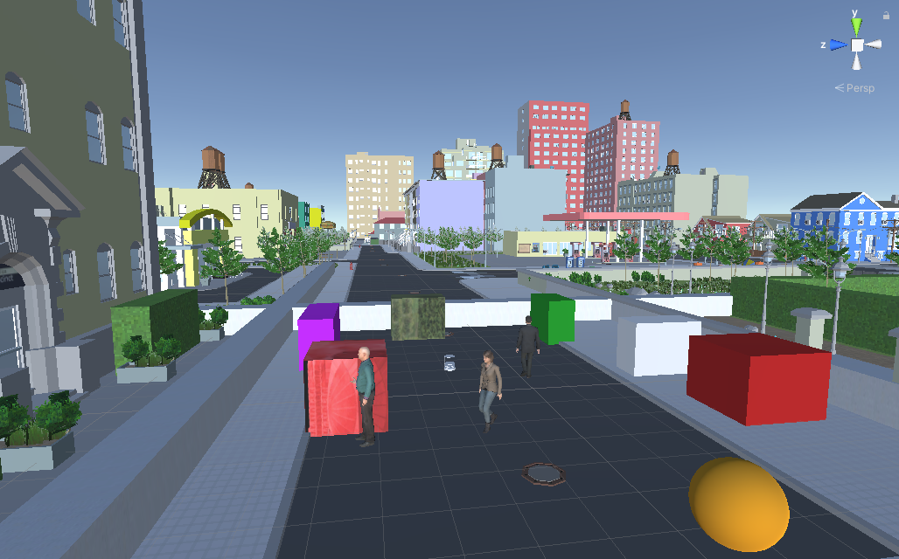

Project Unity version: 2020.1.3f1

# NavRep3DUnity

This is the Unity project used to build the *simple*, *city*, and *office* scenarios for the NavDreams reinforcement-learning paper.

(Looking for the *modern*, *cathedral*, *gallery*, and *replica* scenarios? [This way.](https://www.github.com/danieldugas/NavDreamsUnity) )

## Installing Unity on Ubuntu

[See here.](https://github.com/danieldugas/NavDreamsUnity#installing-unity-on-ubuntu)

## Opening The Project

- make sure to clone with --recursive
- open the project in unity (run the `UnityHub.AppImage` executable and select the project folder).
- open `Assets/Scenes/SimpleRL.unity`, and the *simple* scenario should show. Press play, then in another terminal run `python -m navdreams.navrep3dtrainenv --unity-player-dir None` to allow moving the robot with keyboard keys.
